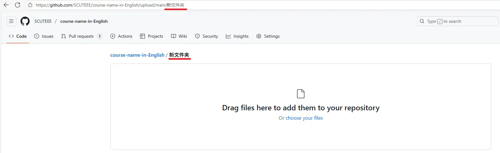

这篇文章介绍如何在 github 上投稿。

<!--more-->

## Git 和 Github 知识预备

如果你从未接触过 Git 和 Github，可以简单阅读一下这里的介绍。

Git 是一个版本控制工具，它可以帮助我们：

- **保存修改历史**：可以回到之前的某个版本，防止误操作。
  - 每次修改后提交一个版本，称为 commit.
- **多人协作**：每个人可以在自己的分支上开发，最后合并成果
  - 主分支称为 main branch，只要有权限，就能直接在 main branch 上 commit
  - 如果没有修改权限，就要将分支复制一份属于自己的分支，称为 folk
  - 新分支合并回主分支，需要先提交申请（pull request），然后才合并（merge）

GitHub 是一个基于 Git 的代码托管平台，你可以把本地 Git 仓库推送到 GitHub 上，实现在线备份和多人协作。

## 新建课程仓库

如果课程仓库已经存在，则可以跳过这一步；如果你在 Github 上未加入 SCUTEEE 组织，那么可以通过邮件/Q群/github issue等方式让管理员帮忙；如果你是管理员，那么按照如下步骤新建仓库：

- 访问 [模板仓库](https://github.com/SCUTEEE/course-template)，点击右上角 `Use this template` - `Create a new repository`

- 填写新仓库的基本信息，注意勾选 `Include all branches`

> 新建完成后记得修改 README.md 和 _index.md，修改方法参考下面的 Step 2

## 修改已有文件

如果只是修改已有文件，可以在 Github 中，点进文件后，点击右上方的铅笔按钮：

或者更直接地，点击文章右边的“在Github上编辑此页”

如果你是 SCUTEEE 组织的管理者，可以直接编辑；否则，你需要先 Folk 后再编辑。

编辑完成后，点击 `Commit changes...`

在弹出的框中，概括修改的内容，然后点击 `Propose changes`

最后点击 `Create pull request`，在新页面中描述修改内容，再次点击 `Create pull request`，即可完成。等后续等管理员检查无误后，就会将修改合并到仓库中。

## 增加新文件

上传文件到已有文件夹：打开对应文件夹，点击绿色 Download 按钮旁的 upload，上传你的文件。

上传文件到新文件夹：打开任意文件夹，点击绿色 Download 按钮旁的 upload，把浏览器地址栏中文件夹名称改为你想要新建的文件夹名称，然后回车，上传你的文件。

可以上传单个或多个文件，可以上传文件夹。
