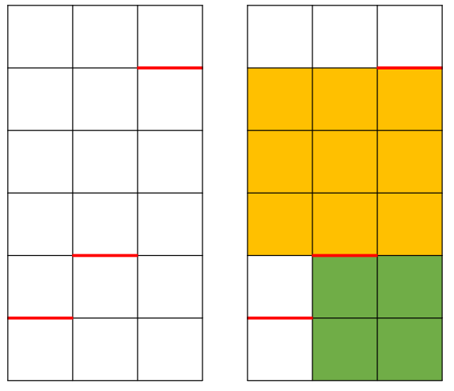

问题描述很简单：

> 如果我们有任意数量的阻值为 1 的电阻。现在我们想要从 $V_{out}$ 电压中分压出 $V_1,V_2,\cdots,V_n$，问至少需要使用多少个电阻？

这个问题的意义在于，在实际电路中，电阻两端、走线等寄生电阻会影响分压，如果能减少电阻数量，就能减小这些非理想效应，获得更精确的分压值。

举个例子。假设我们要获得 $\frac{1}{7}V_{out}$，最直观的方法是用 7 个电阻；但是，我们可以用三个电阻+两个并联电阻，来获得 $\dfrac{0.5}{3.5}=\dfrac{1}{7}$，这样一共只需要 5 个电阻。由上面的方案对比可以看出，巧用并联能获得更优解。

假设 $V_{out}=1$，分压为 $V_1 = \dfrac{a_1}{b_1}$，$V_2=\dfrac{a_2}{b_2}$，$\cdots$， $V_n = \dfrac{a_n}{b_n}$ （$a_k, b_k \in \mathbb{N}_+$，$a_k,b_k$ 互质）。记 $b_1,b_2,\cdots,b_n$ 的最小公倍数为 $B={\rm LCM}(b_1,b_2,\cdots,b_n)$，串联 $B$ 个电阻，可以在第 $\dfrac{a_k}{b_k} B$ 个电阻处得到 $V_k$，这种解法称为 **简单串联**，如果设每个电阻阻值为 1，则总的电阻阻值为 $B$

并联 $\beta$ 个“简单串联”，首尾结点相连，中间同一行的结点电压都是相同的，因此可以选择接在一起 or 不接在一起。从而可以得到一个 $B$ 行 $\beta$ 列的电阻阵列。分压可以选择从某一串中引出，可以是同一串（比如都从第一串引出）或不同串。注意到，在电阻阵列中，如果存在 n×n 的电阻，则可以用 1 个电阻去替代，替代后这 n×n 电阻内部结点的电压全都无法引出，而外部结点的电压不受影响。因此，我们的目标是：用 n×n 的电阻去替换电阻阵列，同时不能破坏引出分压的结点，使得最终电阻数量最少。

为了更方便理解，我们替换为以下算法问题：有一个房间，面积是 $\beta\times B$，在房间中间有多扇横墙（如下图红色线标识），现在要用 n×n 的方形瓷砖铺地（n 为正整数，最小为 1），瓷砖不能旋转，问最少需要多少块瓷砖？



这显然可以用 DP 算法。我们记每一列“未铺瓷砖”的最底端轮廓为 `[0,0,0]`，然后我们尝试往底端从大到小放瓷砖，然后更新底端轮廓为 `[0,2,2]`。对于每个轮廓，显然都有一种最优解，因此如果我们已经计算到了某个最优解，就直接用该最优解去替换，否则就继续尝试往底端从大到小放瓷砖，直到底端轮廓等于 `[B,B,B]`。

下面给出 python 代码（由 GPT 编写，已验证正确）：

```python
import numpy as np
from fractions import Fraction
from math import gcd
from functools import reduce, lru_cache
import itertools

class DesignSolution:
    def __init__(self, B, beta, total_resistors, blocks, tap_assignment):
        self.B = B
        self.beta = beta
        self.total_resistors = total_resistors
        self.blocks = sorted(blocks) 
        self.tap_assignment = tap_assignment 

    def __str__(self):
        tap_str = ", ".join([f"V({v})->Col{c}" for v, c in self.tap_assignment.items()])
        return f"[Beta={self.beta}] 电阻数={self.total_resistors} | 引出配置: {tap_str}"

    def print_grid(self):
        visual_map = np.zeros((self.B, self.beta), dtype=int)
        mark_map = np.full((self.B, self.beta), " ", dtype=object)

        for r, c, size in self.blocks:
            visual_map[r:r+size, c:c+size] = size

        for v_frac, col_idx in self.tap_assignment.items():
            row_idx = int(v_frac * self.B)
            if 0 <= row_idx < self.B:
                mark_map[row_idx, col_idx] = "*"

        print(f"\n>>> 方案详情 (网格 {self.B}行 x {self.beta}列)")
        print(f"    (数字=电阻块边长, '*' = 该位置需引出电压)")
        print("-" * (self.beta * 6 + 6))
        
        for r in range(self.B):
            row_str = f"Row {r}| "
            for c in range(self.beta):
                val = visual_map[r, c]
                mark = mark_map[r, c]
                row_str += f"[{val}]{mark} "
            print(row_str)
        print("-" * (self.beta * 6 + 6))
        
        block_counts = {}
        for _, _, s in self.blocks:
            block_counts[s] = block_counts.get(s, 0) + 1
        desc = ", ".join([f"{s}x{s}:{cnt}个" for s, cnt in block_counts.items()])
        print(f"组成: {desc} (Total: {self.total_resistors})")


class ResistorNetworkSolver:
    def __init__(self, target_voltages):
        self.targets = sorted(list(set(target_voltages)))
        self.B = self._calculate_lcm_denominator()
        self.target_rows = [int(v * self.B) for v in self.targets]
        
        print(f"--- 初始化求解器 ---")
        print(f"目标电压: {self.targets}")
        print(f"网格行数 (B): {self.B}")
        print(f"-------------------")

    def _calculate_lcm_denominator(self):
        denominators = [v.denominator for v in self.targets]
        if not denominators: return 1
        return reduce(lambda a, b: abs(a*b) // gcd(a, b), denominators)

    def _fibonacci(self, n):
        if n <= 0: return 0
        a, b = 1, 1
        for _ in range(n - 2):
            a, b = b, a + b
        return b

    def calculate_harambe_bound(self):
        fib_val = self._fibonacci(self.B + 2)
        return fib_val - self.B

    def solve_for_beta(self, beta, restrict_to_col_zero=False):
        best_sol = None
        num_targets = len(self.targets)
        
        if restrict_to_col_zero:
            # 优化模式：只检查所有引出点都在第 0 列的情况
            col_combinations = [tuple([0] * num_targets)]
        else:
            # 完整模式：遍历所有组合
            col_combinations = itertools.product(range(beta), repeat=num_targets)
            # 警告：如果组合数太多，这里可以考虑更严格的剪枝
        
        for col_combo in col_combinations:
            
            if not restrict_to_col_zero:
                # --- 对称性优化 (只在完整模式下进行) ---
                mirror_combo = tuple(beta - 1 - c for c in col_combo)
                if col_combo > mirror_combo:
                    continue
                # ----------------------------------------

            constraints = []
            assignment_dict = {}
            for i, col_idx in enumerate(col_combo):
                row_idx = self.target_rows[i]
                constraints.append((row_idx, col_idx))
                assignment_dict[self.targets[i]] = col_idx
            
            cost, blocks = self._solve_tiling_with_constraints(beta, tuple(sorted(constraints)))
            
            if best_sol is None or cost < best_sol.total_resistors:
                best_sol = DesignSolution(self.B, beta, cost, blocks, assignment_dict)
        
        return best_sol

    def _solve_tiling_with_constraints(self, beta, constraints):
        B = self.B

        @lru_cache(None)
        def dp(profile):
            min_h = min(profile)
            if min_h == B: return 0, []
            col = profile.index(min_h)
            best_cost = float('inf')
            best_blocks = []

            max_possible_k = min(B - min_h, beta - col)
            limit_k = 1
            for k in range(1, max_possible_k + 1):
                if profile[col + k - 1] != min_h: break
                limit_k = k
            
            for k in range(limit_k, 0, -1):
                is_valid = True
                if k > 1:
                    block_top, block_bottom = min_h, min_h + k
                    block_left, block_right = col, col + k
                    
                    for (req_r, req_c) in constraints:
                        if block_top < req_r < block_bottom and \
                           block_left <= req_c < block_right:
                            is_valid = False
                            break
                
                if not is_valid: continue
                
                new_profile = list(profile)
                for i in range(k): new_profile[col + i] += k
                
                res_cost, res_blocks = dp(tuple(new_profile))
                
                if 1 + res_cost < best_cost:
                    best_cost = 1 + res_cost
                    best_blocks = [(min_h, col, k)] + res_blocks
            
            return best_cost, best_blocks

        return dp(tuple([0] * beta))

    def find_all_best_solutions(self, max_beta=None, restrict_taps_to_first_column=False):
        """
        遍历 Beta，收集所有达到全局最小电阻数的方案。
        restrict_taps_to_first_column: 如果为 True，只检查引出结点都在第 0 列的情况。
        """
        
        harambe_limit = self.calculate_harambe_bound()
        
        if max_beta is None:
            ENGINEERING_HARD_LIMIT = 10 
            max_beta = min(harambe_limit, ENGINEERING_HARD_LIMIT)
            print(f"[智能配置] Harambe 上限: {harambe_limit}. 搜索 Beta 限制为: {max_beta}")
        else:
            print(f"[手动配置] 最大 Beta: {max_beta} (理论上限: {harambe_limit})")

        
        search_mode = "只在第 0 列引出" if restrict_taps_to_first_column else "遍历所有列组合"
        print(f"[搜索模式] 当前模式: {search_mode}")

        global_min_cost = float('inf')
        best_solutions = []

        print(f"\n开始搜索最优解 (Beta 1 ~ {max_beta})...")

        for beta in range(1, max_beta + 1):
            sol = self.solve_for_beta(beta, restrict_to_col_zero=restrict_taps_to_first_column)
            if sol:
                print(f"Beta={beta}: 最少 {sol.total_resistors} 个电阻")
                
                if sol.total_resistors < global_min_cost:
                    global_min_cost = sol.total_resistors
                    best_solutions = [sol]
                elif sol.total_resistors == global_min_cost:
                    best_solutions.append(sol)
        
        return best_solutions

if __name__ == "__main__":
    # 示例用法
    solver = ResistorNetworkSolver([Fraction(1, 2), Fraction(3, 15), Fraction(2, 15)])
    
    # 案例 1: 完整搜索 (默认)
    # print("\n--- 案例 1: 完整搜索 (包含所有列组合) ---")
    # winners_full = solver.find_all_best_solutions(max_beta=3) 
    
    # print("\n" + "="*40)
    # print(f"完整搜索结果: {winners_full[0].total_resistors} 个电阻")
    # print(f"共发现 {len(winners_full)} 种不同 Beta 的最优布局")
    # print("="*40)
    # for sol in winners_full:
    #     sol.print_grid()
        
    # 案例 2: 仅限制在第一列引出 (快速启发式)
    print("\n--- 案例 2: 限制引出结点在第 0 列 ---")
    winners_restricted = solver.find_all_best_solutions(max_beta=12, restrict_taps_to_first_column=True)
    
    print("\n" + "="*40)
    print(f"限制搜索结果: {winners_restricted[0].total_resistors} 个电阻")
    print(f"共发现 {len(winners_restricted)} 种不同 Beta 的最优布局")
    print("="*40)
    for sol in winners_restricted:
        sol.print_grid()
```

如果你有闲情去阅读代码，你会发现对于需要并联 $\beta$ 个“简单串联”，这个 $\beta$ 是存在一个上界的，这个上界在程序中用变量 `harambe_limit` 表示。这是因为：

> 定理：要用阻值为 1 的电阻构造阻值为 $R=\dfrac{a}{b}$ 的电阻，则至少需要 $n$ 个电阻（电阻数量的下界），$n$ 满足：$\phi_{n+2}$ 是第一个大于 $a+b$ 的斐波那契数列。

显然，随着 $\beta$ 不断增大，总电阻值的分子分母之和会不断增大（注：要考虑分子分母约分的情况）。因此我们最少需要的电阻总数会增加，当总数增加到大于“简单串联”的电阻数时，就没必要继续增大 $\beta$ 了。

该定理是在 [algebra precalculus - How many resistors are needed? - Mathematics Stack Exchange](https://math.stackexchange.com/questions/2160766/how-many-resistors-are-needed) 中由网友 Harambe 提出并证明的。具体的证明过程如下：

将 $n$ 个电阻所有可能组合出的阻值列出：

$$
\begin{align*}
n&=1 &&1/1\\
n&=2 &&1+1=2/1\\
& &&1\oplus1 = 1/2\\
n&=3 &&1+(1+1)=3/1\\
& &&1+(1\oplus1) = 3/2\\
& &&1\oplus(1+1) = 2/3\\
& &&1\oplus(1\oplus1) = 1/3\\
n&=4 &&1+(1+(1+1)) = 4/1\\
& &&1+(1+(1\oplus1)) = 5/2\\
& &&1+(1\oplus(1+1)) = 5/3\\
\end{align*}
$$

假设 $n$ 个电阻的组合的阻值用集合 $R_n$ 表示。假设 $M_n = \max\{a+b: a/b \in R_n\}$，比如 $M_1=2$，$M_2=3$，$M_3=5$，$M_4=8$，似乎有 $\phi_{n+2}$ 等于 $M_n$。如果定义 ${\rm Max}(R_n)$ 是满足 $a+b=M_n$ 的 $R_n$ 的集合，从而 $n$ 个电阻能形成的最大电阻必然属于 ${\rm Max}(R_n)$。并且 ${\rm Max}(R_n)$ 似乎总是有两个元素，形如 $\frac{\phi_{n+1}}{\phi_n}$ 和 $\frac{\phi_n}{\phi_{n+1}}$——注意分子分母恰好是斐波那契数列 $\phi_{n+2}$ 的前两个元素，也就是说，如果这句话为正，那么命题也为真。

证明：给定 $n$ 个电阻，唯二的 ${\rm Max}(R_n)$ 元素形如 $\frac{\phi_{n+1}}{\phi_n}$ 和 $\frac{\phi_n}{\phi_{n+1}}$

证明：为方便起见，定义 $v(R)=a+b$，其中 $R=a/b$. 下面用递推法证明。

$n=2$ 时，显然成立。

$n=k$ 时，假设 $n=1 \cdots k$ 均有最大的电阻 $\frac{\phi_{k+1}}{\phi_k}$ 和 $\frac{\phi_k}{\phi_{k+1}}$ 成立，则对于 $n=k+1$，存在 $R=\frac{\phi_{k+2}}{\phi_{k+1}}=1+ \frac{\phi_k}{\phi_{k+1}}$ 和 $R=\frac{\phi_{k+1}}{\phi_{k+2}}=1\oplus \frac{\phi_{k+1}}{\phi_{k}}$，下面证明这两个是最大的。

假设 $R_k = a/b$，其中 $a,b$ 满足 $a+b+n=\phi_k + \phi_{k+1}$，$n>0$. 如果 $a,b \leq \phi_{k+1}$，则 $1+a/b=(a+b)/b=(\phi_{k+2}-n)/b$，从而有 $v(1+a/b)<v(\frac{\phi_{k+2}}{\phi_{k+1}})$，类似的，$1\oplus a/b = a/(b+a) = a/(\phi_{k+2}-n)$，从而 $v(1\oplus a/b) <v(\frac{\phi_{k+2}}{\phi_{k+1}})$

现在假设 $a > \phi_{k+1}$ 或 $b>\phi_{k+1}$，可以证明该假设不成立。因为假设 $b=\alpha + \beta$，$a=\eta+\mu$，其中 $\alpha/\beta,\eta/\mu \in R_{k-1}$ ，根据递推法，这两个和必然不会大于 $\phi_{k+1}$. Q.E.D

另一种证明方法是：假设 $R_{k+1}$ 由 $R_m,R_n$ 串联或并联构造，其中 $m+n=k+1$. 由于 $\phi_s \phi_t<\phi_{s+t}$，因此可以证明 $v(R_m+R_n)\lt v(\frac{\phi_{k+2}}{\phi_{k+1}})$

---

最后，留两个进阶问题给大家：

- 如果分压允许存在一定的误差（比如 5%），那么该如何设计电阻？
- 如果在上面的基础上，允许使用开关（比如用在 trim 电路中），那么该如何设计电阻？
